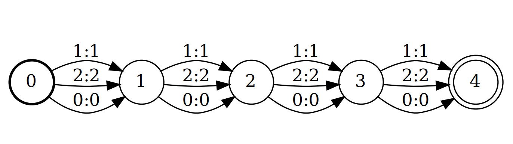
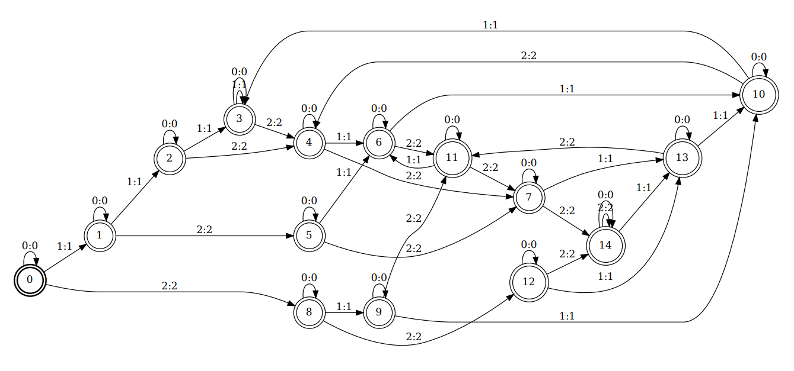

### [Global Normalization for Streaming Speech Recognition in a Modular Framework](https://arxiv.org/pdf/2205.13674)

The following paper introduces the Globally Normalized Autoregressive Transducer (GNAT) for addressing the label bias problem in streaming speech recognition. A non-streaming ASR model’s alignment score has access to the entire input x, while for streaming, it only has access to the prefix of the input feature sequence till the current time frame. Since complete input is available at the start,  locally normalized  model scores can be interpreted as conditional probability distribution. But this doesn't hold for streaming speech recognition. And hence we use Global Normalization to tackle this issue.

Paper provides a framework for calculating the global normalization using FSAs. Details about this can be found in the paper.

We implemented the segment of this pipeline intended for computing the global normalization score based on some provided weights. 

For demonstration purpose we use two different kinds of weight intialisation i.e random and uniform instead of obtaining them from a neural network and then apply the global normalisation to get the probability distribution over all the possible strings. 

We constructed the context and alignment FSAs using the [OpenFst](https://www.openfst.org/twiki/bin/view/FST/WebHome) library.
<br><br> 
As an example, the state diagram corresponding to an alignment FSA for T = 4 is:


<br>
The state diagram for a context FSA with alphabet {a, b} and n = 4 is as follows:




### Dependencies involved:
* OpenFst 1.8.3
* Eigen 

### Instructions for running the code:
Download the two folders *includes* and *link-dep* from the following [link](https://drive.google.com/drive/folders/1qa_rMOMRlXKRw8JsL9Z5iS8fEGTC-IP_?usp=sharing) and keep them in the directory. <br><br>
The final directory structure should be as follows: <br><br>
. <br>
|_ Alignment.cpp <br>
|_Context.cpp <br>
|_GlobalNorm.cpp <br>
|_Makefile <br>
|_create_links.sh <br>
|_show_fst.sh <br>
|_support.h <br>
|_includes <br>
|_link-dep<br>

After this run the script **create_links.sh**  (``` ./create_links.sh ```) to make appropriate symlinks to linker files.

To construct the desired FSAs and calculate the probability of different strings using globalnorm run the following command:
```
make globalnorm
./globalnorm

```
Enter desired values of n (n-gram dependency) and T (total timeframe length) and obtain the probability distribution over the strings. 

After running the make for globalnorm, run the following command to see the FSAs that are created in respective pdf files:
```
make fst
```

Run ``` make clean ``` to clean up the directory. 

### File Descriptions
The code is split accross three files Alignment.cpp, Context.cpp and GlobalNorm.cpp and a header file support.h which includes all the declarations, all of the code was written from scratch,
* Alignment.cpp - This file contains the code for the alignment FSA class, an alignment FSA accepts all strings of length less than or equal to T, where T is the number of timesteps.
* Context.cpp - This file contains the code for the context FSA class, a context FSA remembers the last n inputs and when it makes a transition on any alphabet it forgets the oldest input and remembers the current alphabet.
* GlobalNorm.cpp - This contains the implemtation of the main class that calculates globally normalized sentence scores. The class takes in the context and the alignment FSA to initialize. The Glob_Norm_ASR class contains three functions in it's interface-
  * get_denominator - this function calculates the sum of scores accross all possible sentences of length less than or equal to T. This only needs to be called once.
  * get _numerator - this function calculated the score of a single string.
  * get_pdf - this function generates the probability distribution across all sentences of length less than or equal to T.
